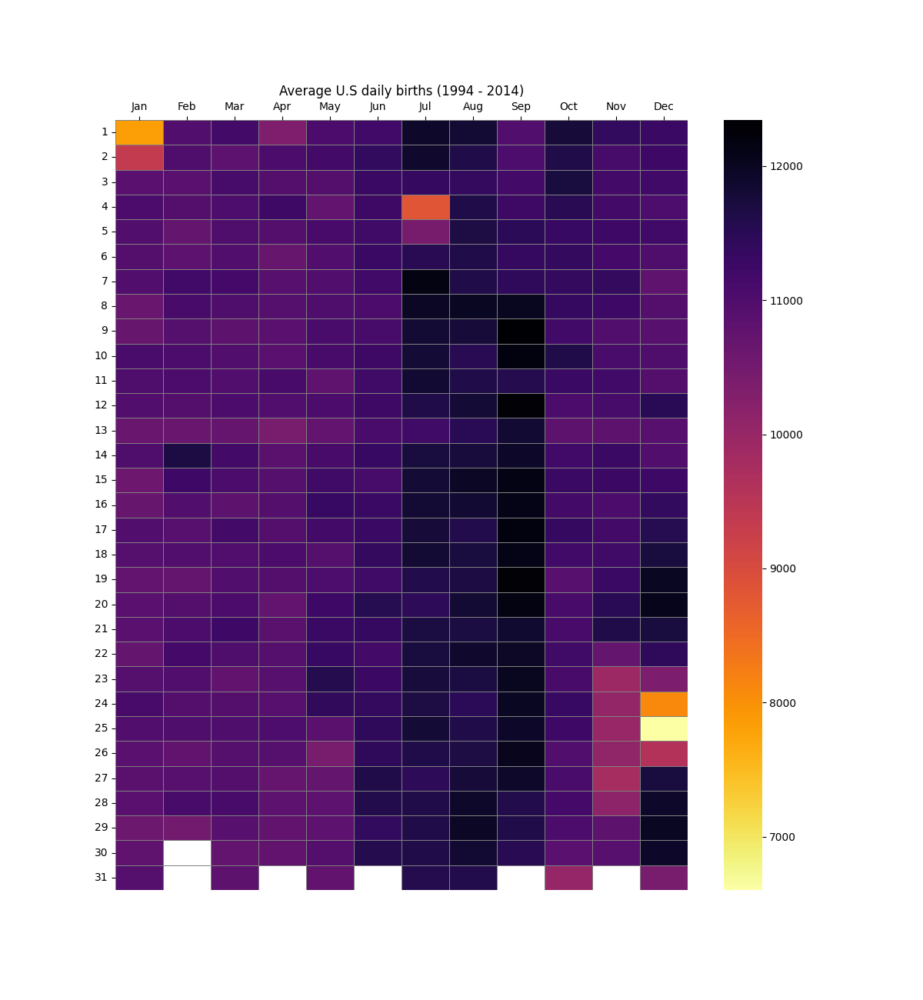
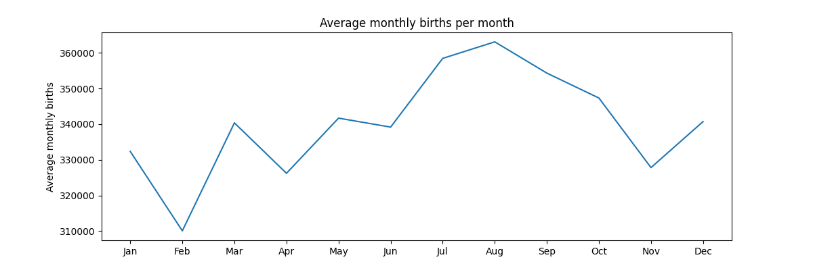
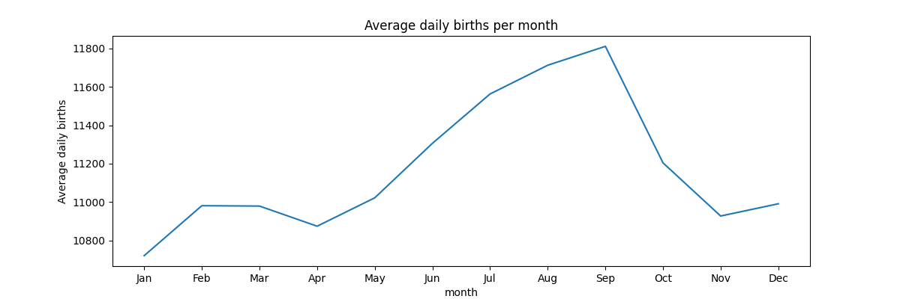
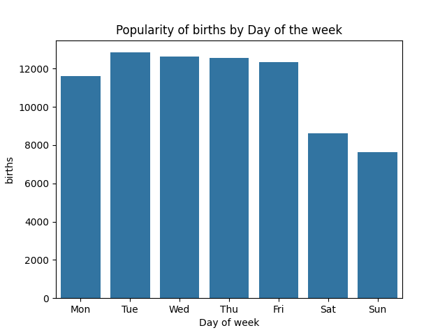
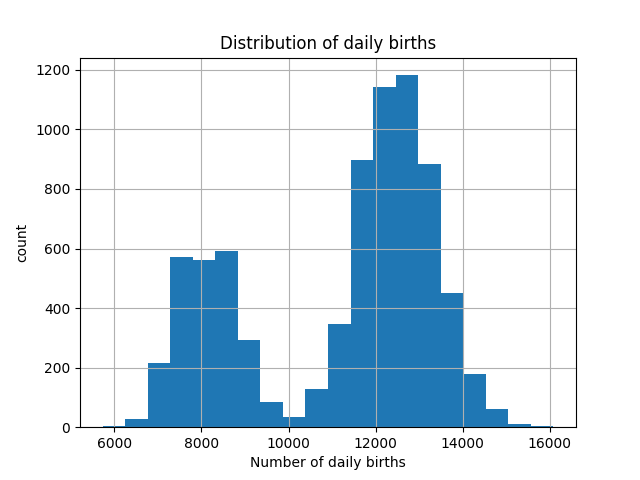
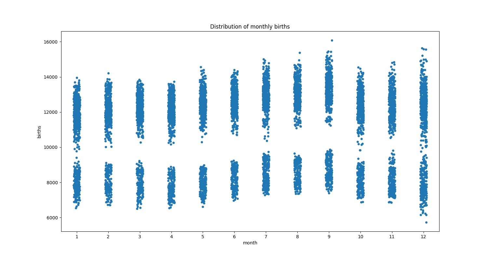

# PROJECT: ANALYSIS OF BIRTHS IN THE UNITED STATES
#### Author: Abasifreke Nkanang (DataBishop)

#### Stack - Python, Pandas, Numpy, Matplotlib, Seaborn

#### Date: July 28, 2022
    
#### [Tableau Dashboard](https://public.tableau.com/app/profile/abasifreke.nkanang/viz/us_births_dataset1994-2014/Dashboard1)

## Aim of the project
 In this project, I conducted an analysis of birth dates in the the United States of America from the year 1994 up till 2014. The aim of the project was to determine the relative popularity of birth dates in the U.S, and also to gain insights on the trend in births from month to year. This analysis will also help determine the distribution of births throughout the time frame in study. This analysis will also aim to gain any other insights relevant to this context.

## Source
The dataset on which this analysis was done was obtained from two sources;  
The U.S National Center for Health Statistics, with data range from (1994 - 2003) <https://github.com/fivethirtyeight/data/blob/master/births/US_births_1994-2003_CDC_NCHS.csv>, and  
The U.S Social Security Administration, with data range from (2004 - 2014) <https://github.com/fivethirtyeight/data/blob/master/births/US_births_2000-2014_SSA.csv>

## Summary and Findings

:bulb: From the heatmap above, We can observe that the most popular birth dates occur in September, during the second and third weeks, and in July, while the least popular birth dates occur during Christmas, New year, and Thanksgiving.

:bulb: The line chart above represents the average number of births for each month. It clearly shows that August, July and September have a higher number of average monthly births, while February has the lowest number of average monthly births.

:bulb: The line chart above represents the average daily births per month. Although August had the highest number of average monthly births, this chart shows that September has the highest average daily births while January has the lowest average daily births.

:bulb: The bar chart above clearly shows that births occur less during weekends.

:bulb: The above chart shows the distribution of daily births, which is skewed to the left.

:bulb: The strip plot above shows the distribution of monthly births.

### Conclusion
Below are some of the insights that i have gained from the analysis;

1.	 September appeared to be the most popular birth month, having nine out of the ten most popular birth dates. With these nine birth dates all occurring between the second and third weeks, three of which are September 9, September 19, and September 12. Following a customary gestation period of 266 days, in theory, many of those babies would have been conceived on December 17, December 27, and December 20 respectively. This therefore shows that more babies are usually conceived during holiday periods, because people tend to have more time for baby-making during these periods (their time off from work, studies etc.).

2.  It can also be observed that births seem less likely to occur during holidays, and on weekends. This is proven by the fact that, all the five least popular birth dates fall within holiday periods; Boxing day, Thanksgiving, New year's day, Christmas eve, and Christmas day, and fewer births occur on Saturdays and Sundays. One reason for this is that, almost no cesarean births are scheduled      by doctors to happen on public holidays and weekends. And studies show that about one in three American babies are born through cesarean sections. Another reason may be that, if doctors plan to induce an expectant mother into labour, they do not schedule it for holiday periods or weekends. Also, doctors may be asked to induce labour on the run up to public holidays like Christmas etc.

3.  A point to note is that, an analysis on the distribution of daily births shows that the data is left-skewed. This is because the mean number of daily births is less than the most occurring number of daily births which is around 12,300.